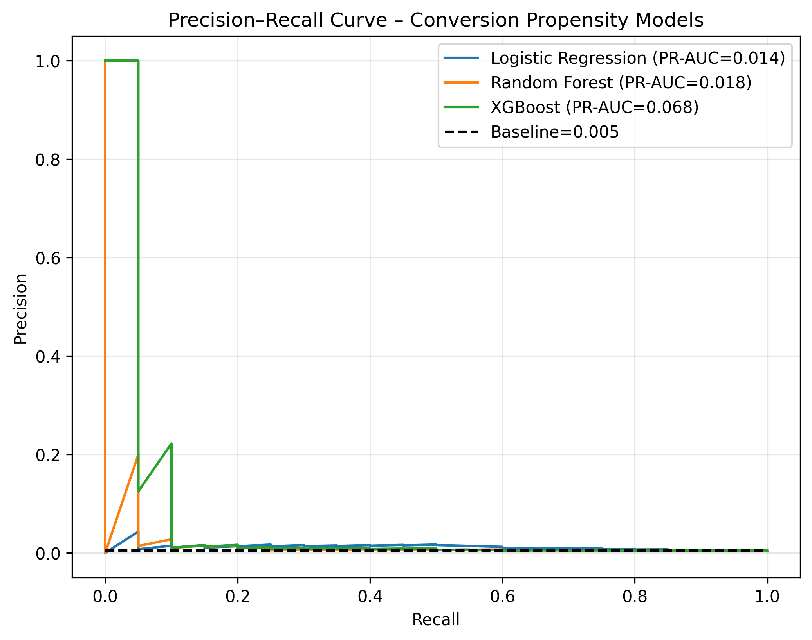

# Predicting Customer Conversion Propensity and Order Value

## Overview

This project focuses on modeling **customer purchasing behavior** on an e-commerce platform using historical transactional and behavioral data. The goal is to identify high-value customers by estimating:

1. **Conversion Propensity** – the probability that a customer will place an order in a future time window.
2. **Order Value** – the expected monetary value of a customer’s order.

---

## Objectives

- Predict the probability of a customer placing an order within a specified future horizon (e.g., 90 days).
- Predict the **average order value** for customers who convert.

---

## Datasets

The following datasets were used to construct the modeling pipeline:

| Dataset | Description |
|-------|-------------|
| `olist_closed_deals_dataset` | Information about marketing deals that resulted in closed sales |
| `olist_customers_dataset` | Demographic information about customers |
| `olist_geolocation_dataset` | ZIP code prefix to geographic metadata mapping |
| `olist_marketing_qualified_leads_dataset` | Marketing-qualified leads from campaigns |
| `olist_order_items_dataset` | Item-level information for each order |
| `olist_order_payments_dataset` | Payment information associated with orders |
| `olist_order_reviews_dataset` | Customer reviews for purchased items |
| `olist_orders_dataset` | Core order-level transactional data |
| `olist_products_dataset` | Product catalog metadata |
| `olist_sellers_dataset` | Seller-level information |

---

## Data Processing & Master Table

To enable customer-level modeling, all relevant datasets were aggregated into a **master table** with the following characteristics:

- **Grain:** Customer ID × Year–Month
- Each row represents a customer with activity in a given month.
- Lower-level entities (items, payments, reviews) are progressively aggregated up to the customer level.

The flow of data is as per the Data Model shown here:


The arrows show the flow of feature and overlap percentage between the tables being joined.


### Excluded Tables

The following datasets were excluded from modeling due to limited relevance to customer purchase behavior:

- **Closed Deals Dataset** – primarily seller/campaign-focused
- **Marketing Qualified Leads Dataset** – more relevant to seller acquisition than customer behavior

---

## Data Quality & Data Integrity Report

A full **Data Integrity and Data Quality (DIDQ)** analysis was performed across all datasets.  
The full report is available here:
[Data Integrity and Data Quality (DIDQ) Report](Reports/didq_report.xlsx)

### DIDQ Report Structure

The **Data Integrity and Data Quality (DIDQ) Report** is organized to enable quick inspection and validation of each dataset:

- **One worksheet per dataset**  
  Each source table is analyzed independently and written to its own Excel sheet.

- **Column-level quality metrics**  
  For every column in a dataset, the following checks and summaries are provided:
  - Null value counts and percentages
  - Duplicate value counts (where applicable)
  - Number of unique values
  - Most frequent and least frequent values (categorical features)
  - Statistical summaries for numerical features, including:
    - Mean
    - Minimum
    - Maximum
    - Variance

- **Consistent schema across sheets**  
  All worksheets follow the same structure, making it easy to compare data quality issues across different tables.

This structure allows systematic identification of missing data patterns, outliers, and potential integrity issues before feature engineering and modeling.

### Key Findings

- No primary keys contain null values.
- No dataset-level duplicates were detected.
- Expected null patterns were observed:
  - Order timestamps vary by order status.
  - Not all orders receive reviews.
- The number of customers who have done more than one purchase ar ~3%, indicating a class imbalance.

All such cases were handled explicitly during modeling phase.

---

## Feature Engineering

A diverse set of customer-level features was engineered to capture historical behavior, spending patterns, and preferences.  
Features were derived through systematic aggregation of lower-level transactional data and can be broadly categorized as follows.

**Detailed documentation for every engineered feature — including source tables, aggregation logic, and definitions — is available in the  
[Feature Engineering File](Feature%20Engineering.xlsx).**

### 1. Count-Based (Numerical) Features
These features capture **how often** a customer interacts with the platform.

- Number of orders placed
- Number of products purchased
- Number of sellers interacted with
- Number of reviews submitted

**Aggregation logic:**  
Counts are computed by aggregating order- and item-level records grouped by `customer_unique_id` and time window.

### 2. Monetary (Total / Aggregate) Features
These features quantify **how much** a customer spends or pays through different channels.

- Total order value
- Total payment value
- Payment value split by payment type (credit card, boleto, voucher, etc.)
- Total freight cost

**Aggregation logic:**  
Monetary values are summed over all relevant transactions for a customer within the aggregation period.

### 3. Pivoted Status-Based Features
These features capture **order lifecycle behavior** by splitting aggregates across different order states.

- Number of orders by status (approved, shipped, delivered, canceled, etc.)
- Total order value by status
- Total freight value by status
- Average order size by status

**Aggregation logic:**  
Order-level metrics are first grouped by `(customer_unique_id, order_status)` and then pivoted into separate columns per status.

### 4. Recency and Temporal Features
These features describe **how recently** a customer interacted with the platform.

- Days since last order purchased
- Days since last order shipped
- Days since last review created

**Aggregation logic:**  
Recency is calculated as the difference between the snapshot date and the most recent relevant timestamp per customer.

### 5. Preference-Based Features
These features summarize **customer preferences** inferred from historical behavior.

- Preferred product category
- Preferred product category (English mapping)
- Most frequent payment method

**Aggregation logic:**  
Preferences are derived using **mode-based aggregation**, selecting the most frequently occurring value per customer.

### 6. Ratio and Average Features
These features normalize totals to reflect **behavioral intensity** rather than scale.

- Average order size
- Average order price
- Average freight value
- Average review score

**Aggregation logic:**  
Computed as ratios of aggregated totals (e.g., total value divided by number of orders).


Together, these feature groups provide a comprehensive representation of customer behavior across frequency, monetary value, recency, lifecycle dynamics and preferences, forming the foundation for both propensity and order value modeling.

---

## Feature Validation

To ensure correctness and prevent leakage:
- Feature values were manually validated for multiple customer IDs.
- Temporal alignment was verified to ensure no future information leaks into historical features.

---

## Feature Selection

To improve stability and interpretability:
- Pairwise Pearson correlation was computed across numeric features.
- A threshold of **0.7** was applied.
- One feature from each highly correlated pair was removed prior to modeling.

---

## Label Creation

To ensure realistic and leakage-free modeling, both propensity and order value labels are created using a **future-looking time horizon** relative to a fixed snapshot date.

### Snapshot and Horizon Definition

- A **snapshot date** is defined for each modeling run (e.g., end of a given month).
- A fixed **prediction horizon** of 90 days is used.
- Only information available **on or before the snapshot date** is used for feature computation.
- Labels are derived strictly from customer activity **after the snapshot date and within the horizon window**.

---

### 1. Conversion Propensity Label

The propensity label indicates whether a customer places **at least one order** within the future prediction horizon.

**Label definition:**

- `y_propensity = 1`  
  If the customer places one or more orders within the next 90 days after the snapshot date.
- `y_propensity = 0`  
  Otherwise.

**Computation logic:**

- Orders are filtered to those with purchase timestamps:
  - greater than the snapshot date, and
  - less than or equal to snapshot date + 90 days.
- Orders are mapped to customers using `customer_id → customer_unique_id`.
- A binary indicator is created per customer based on the presence of at least one order in the horizon.

This formulation captures **future purchase intent**, not historical frequency.

---

### 2. Order Value Label

The order value label represents the **monetary value of customer purchases** within the future horizon, conditional on conversion.

**Label definition:**

- `y_value` is defined as the **average order value** generated by a customer within the prediction horizon.
- For modeling stability, the target is log-transformed:
  ```text
  y_value_log = log(1 + y_value)

### Computation logic:

Item-level aggregation

From the **olist_order_items_dataset**, item-level price and freight_value are summed.

These values are first aggregated at the order_id level, producing a total order value per order.

Order-level values are joined with the orders dataset to associate orders with customers.

All orders placed by a customer within the future horizon are aggregated at the
**customer_unique_id** level (sum or average, depending on modeling objective).

---

## Modeling Approach

A **two-stage modeling framework** was adopted.

### Stage 1: Conversion Propensity

- **Target:** Whether a customer places an order in the next 90 days.
- **Models evaluated:**
  - Logistic Regression
  - Random Forest Classifier
  - Gradient Boosting (XGBoost)
  - Neural Network baseline
- **Metric:** PR-AUC (chosen due to strong class imbalance)

### Stage 2: Order Value Regression

- **Target:** Average order value for customers who convert.
- **Models evaluated:**
  - Linear (Ridge) Regression
  - Random Forest Regressor
  - XGBoost Regressor
- Target values were log-transformed to handle heavy skew.
- **Metrics:** MAE and RMSE (reported on original value scale).

The Model Pipeline is shown below:


---

## Key Results

## Modeling Results

### Stage 1: Conversion Propensity (Classification)

| Model | Best Hyperparameters | Validation PR-AUC |
|------|----------------------|------------------|
| Logistic Regression | C=0.1, penalty=none, class_weight=none | 0.0135 |
| Random Forest Classifier | n_estimators=500, max_depth=5, min_samples_leaf=1 | 0.0182 |
| XGBoost Classifier | n_estimators=100, learning_rate=0.05, max_depth=3, subsample=0.8, colsample_bytree=1.0 | 0.0684 |
| Neural Network (MLP) | 3 hidden layers, dropout=0.2, Adam (lr=1e-3) | ~0.01–0.03 |

**Metric:** PR-AUC (chosen due to extreme class imbalance)

The PR-AUC for all the models is as shown below


---

### Stage 2: Order Value Prediction (Regression)

| Model | Best Hyperparameters | MAE | RMSE |
|------|----------------------|-----|------|
| Ridge Regression | alpha=0.1 | 41789.544 | 620875.017 |
| Random Forest Regressor | n_estimators=300, max_depth=None, min_samples_leaf=5, max_features=0.7 | 16.903 | 142.445 |
| XGBoost Regressor | n_estimators=800, learning_rate=0.03, max_depth=5, subsample=0.8, colsample_bytree=0.8 | 23.034 | 173.334 |

**Metric:** MAE and RMSE (evaluated on original value scale after inverse log transform)

**Key Insights**:

- Linear models perform poorly for both propensity and value prediction.
- Tree-based models capture non-linear effects and perform substantially better.
- Random Forest and XGBoost outperform linear baselines for value prediction.
- Conversion propensity remains a challenging, low-signal problem due to extreme class imbalance and temporal drift.

---

## Model Analysis – Conversion Propensity

### Top Features by Importance

The table below lists the most influential features identified by the best-performing classification model, ranked by relative importance.

| Rank | Feature | Importance |
|------|--------|------------|
| 1 | tot_pymt_sqntl | 0.1072 |
| 2 | num_products | 0.0975 |
| 3 | num_rev_delivered | 0.0772 |
| 4 | tot_pymt_boleto | 0.0755 |
| 5 | tot_order_freight_value | 0.0748 |
| 6 | tot_pymt_val | 0.0730 |
| 7 | avg_rev_title_length | 0.0686 |
| 8 | avg_rev_score | 0.0658 |
| 9 | avg_pymt_instllmnt | 0.0657 |
| 10 | avg_rev_length | 0.0641 |
| 11 | days_since_lst_rev_creation | 0.0615 |
| 12 | avg_order_size | 0.0599 |
| 13 | tot_pymt_val_canceled | 0.0570 |
| 14 | tot_pymt_voucher | 0.0523 |

---

### Interpretation and Insights

- **Payment behavior features** (total payment value, payment sequence, installments, and payment type splits) dominate the ranking, indicating that how a customer pays is a strong signal of future purchase intent.
- **Engagement-related features**, such as review counts and review text characteristics, are highly predictive, suggesting that post-purchase interaction correlates with repeat purchasing.
- **Order composition features** (number of products, average order size, freight value) capture the depth and complexity of prior transactions, which helps distinguish casual buyers from committed customers.
- **Recency-related signals**, especially around reviews, remain important, reinforcing that recent engagement is a key driver of near-term conversion.
- Overall, the importance distribution confirms that **conversion propensity is driven more by behavioral and transactional patterns than by static customer attributes**, aligning with expectations for repeat-purchase prediction.

---

## Model Analysis – Order Value Prediction

### Top Features by Importance

The table below shows the most influential features for the best-performing **order value regression model**, ranked by relative importance.

| Rank | Feature | Importance |
|------|--------|------------|
| 1 | tot_pymt_val | 0.8545 |
| 2 | num_products | 0.0557 |
| 3 | tot_order_freight_value | 0.0545 |
| 4 | tot_pymt_boleto | 0.0155 |
| 5 | avg_pymt_instllmnt | 0.0083 |
| 6 | num_rev_delivered | 0.0036 |
| 7 | days_since_lst_rev_creation | 0.0025 |
| 8 | tot_pymt_sqntl | 0.0020 |
| 9 | avg_rev_length | 0.0010 |
| 10 | avg_order_size | 0.0007 |

---

### Interpretation and Insights

- **Total historical payment value** overwhelmingly dominates the model, indicating strong persistence in customer spending behavior over time.
- **Order composition features**, such as the number of products and freight value, play a secondary but meaningful role by capturing basket size and logistics-related costs.
- **Payment structure variables** (installments and boleto usage) contribute modestly, reflecting differences in purchasing capacity and payment preferences.
- **Engagement-related features**, including reviews and their recency, have limited direct impact on monetary value compared to their role in conversion propensity.
- Overall, the results suggest that **order value is primarily driven by historical spend magnitude**, while behavioral signals act as fine-grained refinements rather than primary drivers.
- These findings contrast with the propensity model, where engagement and recency signals dominate, highlighting the complementary nature of the two-stage modeling framework.

---

## Key Takeaways

- Customer purchase behavior is **highly non-linear** and temporally sensitive.
- Feature engineering and correct time alignment are more impactful than model complexity alone.
- A two-stage **propensity × value** framework provides a principled way to estimate expected customer value.

---

## Repository Structure

The repository is organized to clearly separate data processing, feature engineering, modeling, and evaluation steps.

## Repository Structure

```text
Scowtt-Customer_Behavior-Prediction/
├── Data/
│   ├── processed/
│   └── raw/
├── Models/
│   ├── Order Value/
│   └── Purchase Propensity/
├── Notebooks/
│   ├── data_processing/
│   └── model/
├── Reports/
│   └── didq_report.xlsx
├── .gitignore
├── Data Model.png
├── Feature Engineering.xlsx
├── Model Training Pipeline.png
├── pr_auc_curves.png
├── README.md
└── requirements.txt
```

### How to Run the Notebooks

### 1. Environment Setup

Create a Python environment and install dependencies:

```bash
pip install -r requirements.txt
```

### 2. Running the Notebooks
To ensure the data pipeline runs correctly, follow the steps below in the specified order:

- Data Processing Pipeline Navigate to Notebooks/data_processing/ and execute these
  - data_check.ipynb: Validates the source files in Data/raw/.
  - feature_engineering.ipynb: Constructs the final analytical dataset (Customer Snapshots).

- Model Training & Evaluation Navigate to Notebooks/model/ and execute these notebooks:
  - feature_selection.ipynb: Runs feature selection script to get the features required for modeling.
  - training.ipynb: Trains classification for customer purchase propensity and regression models for expected order value (saved to Models/Order Value/).
---

## Future Work

- Rolling backtests across multiple snapshot months
- Expected value modeling at scale
- Calibration of propensity scores
- Feature attribution using SHAP
- Production-ready scoring and monitoring pipeline

---

## Use of AI in Project Development

- AI tools were used to speedy development of pipelines once the codes and models were tested independently.
- AI tools were used to debug and optimize modeling pipelines.
- Documentation and reporting, including the README.

---